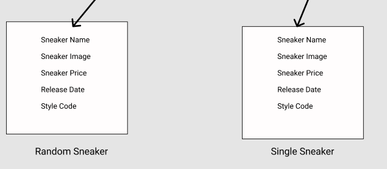

# Sneaker Database API

## Deployed App: https://infallible-mahavira-ecd53c.netlify.app/

## screenshots of my wireframe

# Problem 

The sneaker database is designed to display a library of sneakers from various brands. Sneakers are a major piece in todays pop culture
where they play an important role in young people's fashion and also from a business standpoint, there are many sneakers that appreciate in value after retail purchase, which allows buyers to buy sneakers hold on to them and sale them at a higher value in the future.

# Project Overview

This is a react application that uses an API from https://thesneakerdatabase.com/api/. Using this application I created views to render the endpoints that the api offers. Using React-router-dom, I set up the routes to render each view. This API was used from https://rapidapi.com/ which allows endpoints that list up to 100 sneakers, a single sneaker, brands, and genders. 

# Still in Progress

Currently I am working on the CSS to make the app responsive for mobile. Also the creators of the API have announced that they are working on a version 2 of the API, with the upcoming version I would hope to be able to access more of the sneakers in the database as there are over 3000 sneakers in the API but the max limit that can be accessed is 100 sneakers. Also I would like to include a side navigation that would link websites to users for buying sneakers and information on upcoming sneaker releases.

